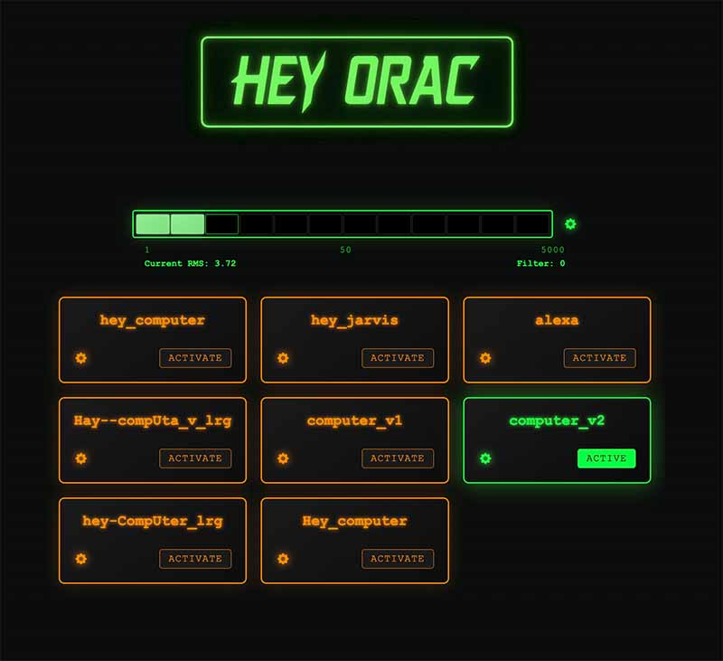
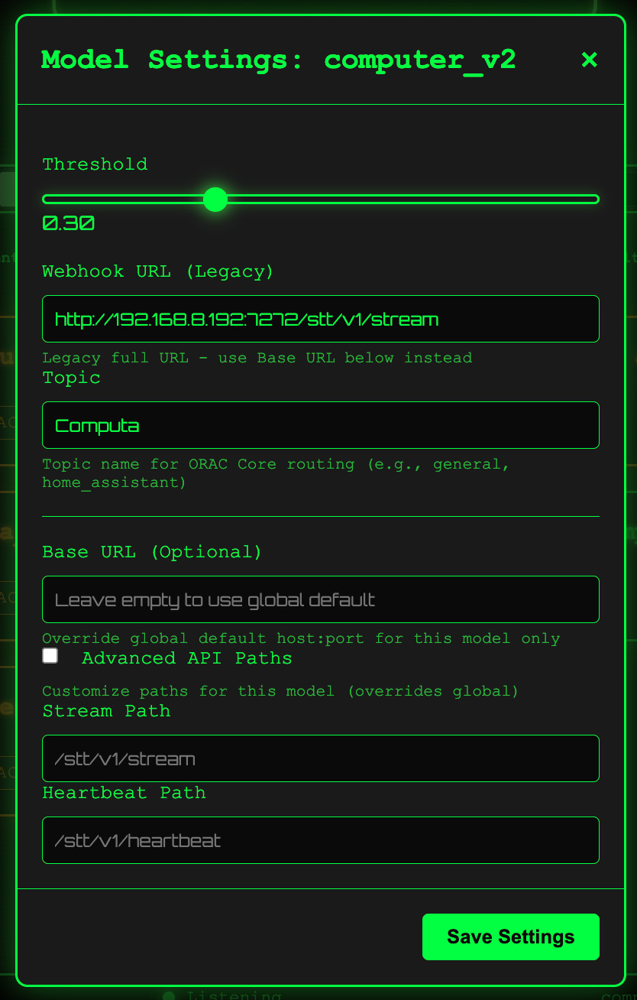

# Hey ORAC Wake-Word Module

A Raspberry Pi container for continuous wake-word detection using OpenWakeWord with full Speech-to-Text integration and topic-based routing.

## Documentation

- **[User Guide](USER_GUIDE.md)** - Complete guide for end users and system administrators
- **[Developer Guide](DEVELOPER_GUIDE.md)** - Architecture, development setup, and contribution guidelines
- **[STT API Reference](STT_API_REFERENCE.md)** - ORAC STT Service API documentation
- **[Development Log](devlog.md)** - Chronological development history and decisions

## Features

- **Real-time Wake-Word Detection**: Multiple OpenWakeWord models with configurable thresholds
- **Topic-Based Routing**: Per-model topic configuration for context-aware processing
- **STT Integration**: Automatic speech recording and transcription after wake word detection
- **Web Administration**: Real-time monitoring dashboard with configuration management
- **Hot-Reloadable Configuration**: Dynamic model and parameter updates without restart
- **Audio Streaming**: Configurable webhook endpoints for downstream processing
- **Docker Containerized**: Easy deployment with automated scripts
- **Prometheus Metrics**: Comprehensive observability and monitoring
- **Heartbeat System**: Active connection monitoring with ORAC STT

## STT Integration

Hey ORAC includes a complete Wake Word → Speech-to-Text pipeline:

- **Pre-roll Audio Capture**: Records 1 second of audio before the wake word for complete context
- **Automatic Speech Recording**: Uses silence detection with configurable thresholds
- **Background Processing**: Non-blocking STT to maintain wake word detection performance
- **Per-Model Configuration**: Individual webhook URLs and STT settings per wake word model
- **ORAC STT Integration**: Optimized for ORAC STT service with whisper.cpp acceleration

### STT Configuration

Configure STT in your `settings.json`:

```json
{
  "stt": {
    "enabled": true,
    "base_url": "http://192.168.8.191:7272",
    "timeout": 30,
    "pre_roll_duration": 1.0,
    "silence_threshold": 0.01,
    "silence_duration": 0.3,
    "grace_period": 0.4,
    "max_recording_duration": 15.0,
    "enable_per_model": true
  },
  "models": [
    {
      "name": "hey_computer",
      "stt_enabled": true,
      "webhook_url": "http://192.168.8.191:7272/stt/v1/stream",
      "topic": "home_assistant"
    }
  ]
}
```

## Hardware Requirements

### Raspberry Pi Setup
- **Recommended**: Raspberry Pi 4B (4GB+ RAM)
- **Audio**: USB microphone (16kHz capable) - tested with BLUE Snowball iCE
- **Storage**: 8GB+ SD card for models and recordings
- **Network**: Ethernet or stable WiFi for STT integration

### Audio Device Configuration
- **Supported Formats**: Stereo input (auto-converted to mono)
- **Sample Rates**: Auto-resampling to 16kHz for OpenWakeWord
- **USB Audio**: Automatic device selection with `auto_select_usb: true`

### Docker Permissions
Ensure audio device access:
```bash
# Add user to audio group
sudo usermod -a -G audio $USER

# Device access in docker-compose.yml
devices:
  - /dev/snd:/dev/snd
```

## Quick Start

### Running with Docker

```bash
docker run -d --name hey-orac \
  --device /dev/snd \
  -v $(pwd)/config:/config \
  -v $(pwd)/models:/models \
  -p 7171:7171 \
  ghcr.io/2oby/hey-orac:latest
```

### Building from Source

```bash
# Clone the repository
git clone https://github.com/2oby/hey-orac.git
cd hey-orac

# Build Docker image
./scripts/build_image.sh

# Deploy to Raspberry Pi
./scripts/deploy_and_test.sh "Initial deployment"
```

## Configuration

Configuration is managed through `/config/settings.json.template` (copy to `settings.json`):

```json
{
  "version": "1.0",
  "models": [
    {
      "name": "hey_computer",
      "path": "/app/models/openwakeword/Hey_computer.tflite",
      "framework": "tflite",
      "enabled": true,
      "threshold": 0.5,
      "priority": 1,
      "webhook_url": null,
      "stt_enabled": true
    }
  ],
  "audio": {
    "sample_rate": 16000,
    "channels": 2,
    "chunk_size": 1280,
    "device_index": null,
    "auto_select_usb": true
  },
  "system": {
    "log_level": "INFO",
    "models_dir": "/app/models",
    "recordings_dir": "/app/recordings",
    "metrics_enabled": true,
    "metrics_port": 7171,
    "hot_reload_enabled": true,
    "multi_trigger": false,
    "rms_filter": 50.0,
    "cooldown": 2.0,
    "vad_threshold": 0.5
  },
  "stt": {
    "enabled": true,
    "base_url": "http://192.168.8.191:7272",
    "timeout": 30,
    "language": null,
    "pre_roll_duration": 1.0,
    "silence_threshold": 0.01,
    "silence_duration": 0.3,
    "grace_period": 0.4,
    "max_recording_duration": 15.0,
    "enable_per_model": true
  }
}
```

### Key Configuration Parameters:
- **vad_threshold**: OpenWakeWord voice activity detection (0.0-1.0)
- **threshold**: Model activation threshold (0.0-1.0) 
- **cooldown**: Detection event spacing in seconds (0-5s)
- **rms_filter**: Audio level filtering (0-100)
- **multi_trigger**: Allow multiple simultaneous wake word detections
- **stt_enabled**: Enable STT recording for individual models

## Web Interface

Access the web interface at `http://your-pi:7171` for comprehensive monitoring and configuration:

### Real-time Monitoring
- **Audio Level Meter**: Visual RMS display with segmented LCD-style blocks
- **Detection Events**: Live wake word detection notifications with timestamps and confidence scores
- **Connection Status**: WebSocket connection and system health indicators
- **Model Status**: Real-time display of enabled models and their thresholds

### Configuration Management  
- **Model Settings**: Enable/disable models, adjust thresholds, configure webhook URLs
- **Global Settings**: VAD threshold, cooldown timing, RMS filtering
- **STT Configuration**: Per-model STT enable/disable and endpoint configuration
- **Settings Persistence**: All changes survive container restarts

### Dashboard Features
- **Dark Theme**: Green neon aesthetic optimized for 24/7 monitoring
- **Real-time Updates**: 10Hz WebSocket streaming for immediate feedback
- **Mobile Responsive**: Works on desktop, tablet, and mobile devices
- **Audio Playback**: Review recorded audio clips (when available)

## Screenshots

### Main Dashboard
The main dashboard shows real-time audio levels, model status, and detection events.



### Model Configuration
Each model can be configured individually with threshold, topic, webhook URL, and advanced endpoint settings.



## Deployment

### Quick Deploy to Raspberry Pi

1. **Clone and Configure**:
```bash
git clone https://github.com/2oby/hey-orac.git
cd hey-orac
cp config/settings.json.template config/settings.json
# Edit settings.json with your configuration
```

2. **Deploy with Automated Scripts**:
```bash
# Automated deployment and testing
./scripts/deploy_and_test.sh "Initial deployment"
```

3. **Manual Docker Deployment**:
```bash
# Build container
docker-compose build --no-cache

# Run service
docker-compose up -d

# Check status
docker-compose ps
docker-compose logs -f hey-orac
```

### Health Checks
```bash
# Service status
curl http://your-pi:7171/api/health

# Metrics
curl http://your-pi:7171/metrics

# WebSocket connectivity test via web interface
open http://your-pi:7171
```

## Development

### Prerequisites

- Python 3.11+
- Docker
- PortAudio (for local development)

### Setup Development Environment

```bash
# Install dependencies
pip install -e .[dev]

# Run tests
pytest

# Run linting
black src tests
ruff check src tests

# Type checking
mypy src
```

### Running Tests

```bash
# Unit tests
pytest tests/unit

# Integration tests
pytest tests/integration

# Coverage report
pytest --cov=hey_orac --cov-report=html
```

## Architecture

The module follows a modular architecture optimized for real-time performance:

- **Audio Module**: Handles microphone input, ring buffer management, and pre-roll capture
- **Models Module**: Manages OpenWakeWord model loading, inference, and hot-reloading
- **Config Module**: Settings management with hot-reload support and validation
- **Transport Module**: STT client and webhook integration for downstream processing
- **Web Module**: REST API, WebSocket interface, and real-time dashboard
- **Speech Recorder**: Post-wake-word audio capture with endpointing
- **Audio Reader Thread**: Non-blocking audio capture with multi-consumer distribution

### Audio Processing Pipeline
```
Microphone → AudioReaderThread → Multi-Consumer Distribution
                    ↓                        ↓
            Producer Thread          Consumer Queues
                    ↓                    ↓         ↓
            stream.read()         main_loop   speech_recorder
                    ↓                    ↓         ↓ 
            Audio Chunks →      Wake Detection  Recording
                                     ↓              ↓
                                Ring Buffer    STT Stream
```

### Multi-Consumer Audio Architecture
The system uses a sophisticated audio distribution mechanism to ensure all components receive complete audio streams:

- **AudioReaderThread**: Dedicated thread for non-blocking audio capture
  - Isolates blocking `stream.read()` calls in separate thread
  - Distributes audio to multiple registered consumers
  - Each consumer gets its own queue with complete audio data
  
- **Consumer Registration**: Components register/unregister dynamically
  - Main wake word detection loop: `main_loop` consumer
  - Speech recorder: `speech_recorder` consumer (on-demand)
  - Extensible for future consumers
  
- **Benefits**:
  - No audio data loss or competition between components
  - Clear, complete audio for all consumers
  - Thread-safe with automatic health monitoring
  - Backward compatible with legacy single-queue mode

## API Reference

### Configuration Endpoints
- `GET /api/config` - Get current configuration
- `POST /api/config/global` - Update global settings (VAD threshold, cooldown, RMS filter)  
- `POST /api/config/models/{model_name}` - Update model-specific settings
- `GET /api/models` - List available models with status

### Monitoring Endpoints
- `GET /api/health` - Service health check
- `GET /metrics` - Prometheus metrics
- `WebSocket /socket.io/` - Real-time events (RMS levels, detections)

### WebSocket Events
- `rms_update` - Audio level updates (10Hz)
- `wake_detected` - Wake word detection events with model name and confidence
- `config_changed` - Configuration update notifications
- `models_config` - Model configuration broadcasts
- `stt_result` - Speech-to-text transcription results

### STT Integration
- **Audio Format**: 16kHz, 16-bit mono WAV
- **Pre-roll Duration**: Configurable (default 1.0 seconds)
- **Max Recording**: Configurable timeout (default 15 seconds)
- **Silence Detection**: Configurable thresholds for speech endpointing

## Troubleshooting  

### Audio Issues
**Problem**: No audio input detected
```bash
# Check audio devices
docker exec hey-orac python -c "import pyaudio; p=pyaudio.PyAudio(); [print(f'{i}: {p.get_device_info_by_index(i)}') for i in range(p.get_device_count())]"

# Test microphone access
docker logs hey-orac | grep -i audio
```

**Problem**: Audio clipping or distortion
- Adjust `rms_filter` in global settings (try 30-70 range)
- Check microphone placement and ambient noise levels
- Verify USB microphone power supply and connection
- Enable debug logging to monitor RMS levels

### Configuration Issues  
**Problem**: Settings not persisting
- Ensure `settings.json` exists (copy from `settings.json.template`)
- Check file permissions: `chmod 644 config/settings.json`
- Verify JSON syntax with `python -m json.tool config/settings.json`
- Check container volume mounts in docker-compose.yml

**Problem**: Models not loading
- Verify model files exist in `/app/models/openwakeword/`
- Check model paths in configuration match actual file locations
- Ensure proper framework specification (`tflite` vs `onnx`)

### STT Integration Issues
**Problem**: STT not working after wake word detection
- Verify ORAC STT service is running: `curl http://192.168.8.191:7272/health`
- Check `stt.base_url` matches your STT service location
- Ensure `stt_enabled: true` for specific models
- Enable STT debug: Set `log_level: "DEBUG"` in settings.json

**Problem**: No audio being sent to STT
- Check pre-roll buffer configuration
- Verify silence detection thresholds
- Monitor logs for endpointing decisions
- Test with shorter `max_recording_duration`

### Performance Issues
**Problem**: High CPU usage or slow detection
- Disable unused models in configuration
- Increase `cooldown` to reduce duplicate detections  
- Consider using `onnx` models instead of `tflite` for better performance
- Adjust `chunk_size` for optimal processing balance

**Problem**: Memory usage growing over time
- Check for audio buffer leaks in logs
- Restart container periodically if needed
- Monitor `/app/recordings` directory size
- Ensure proper cleanup of STT client resources

### Network Issues
**Problem**: WebSocket connection failures
- Check firewall settings for port 7171
- Verify network connectivity between client and Pi
- Test with curl: `curl -I http://your-pi:7171`
- Monitor container logs for connection errors

**Problem**: STT service unreachable
- Verify STT service is running on configured host/port
- Check network routing between Hey ORAC and STT service
- Test direct connection: `curl http://stt-host:7272/health`
- Verify webhook URLs in model configuration

## License

MIT License - see LICENSE file for details.